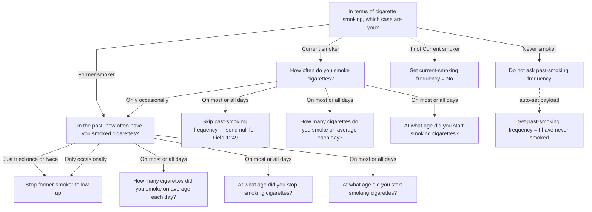
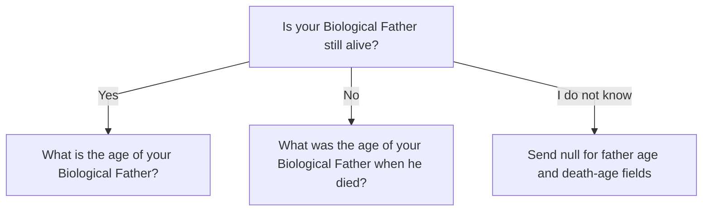

Last updated: 2026-04-15

## Table of Contents

- [1) Document Overview & Purpose](#document-overview-purpose)
- [2) Health Questionnaire Markers](#health-questionnaire-markers)
- [3) Graphical Conditional Question Trees](#graphical-conditional-question-trees)
- [4) Blood Markers](#blood-markers)
- [5) B2B API Payload Guidance](#b2b-api-payload-guidance)
- [6) Markers that will be derived by our pipeline](#markers-that-will-be-derived-by-our-pipeline)

## 1) Document Overview & Purpose

This document defines **what B2B partners need to ask their end consumers** in order to collect the data required for an IduScore report. It covers question wording, conditionality (which questions to show and when), accepted values, and how each answer maps to the Idunox data model.

This document covers both active panels:

| Panel | Details |
| --- | --- |
| **IduScore B2B** | Version for our B2B partners |

**Scope (this document vs API contract):**

- This document defines questionnaire and marker requirements for partners: what to ask or collect, accepted values/ranges, conditional questionnaire flow, and which features are derived by the Idunox pipeline.
- This document is not the API contract. API endpoint URLs, authentication, request/response envelope, error codes, report delivery, and webhook/notification behavior are documented separately in the API contract.

---

## 2) Health Questionnaire Markers

This section contains all questions that B2B partners must present to the end consumer in their intake form. Each row represents a question or field to be collected from the end consumer.

### Column Descriptions

| Column | Description |
| --- | --- |
| **Marker** | The question/field name as it should appear in the intake form |
| **Type** | Data type: `string`, `number`, `string/null`, `number/null` |
| **Accepted values / range** | Valid responses (e.g., `Yes`, `No`, or numeric ranges like `0..120`) |
| **Requirement / conditionality** | Whether this question is asked to **all end consumers** or only under **certain conditions**. This determines the intake form’s **questionnaire flow** (which questions are shown/asked). **“Required”** → all end consumers are asked (no conditions). **“Conditional: required when X”** → the question is asked only if the condition is met in the form’s questionnaire flow (e.g., “when smoking status is Current smoker”). **“else send null” / “else send No”** → when the condition is not met, the value to include in the API payload sent to Idunox (apply in backend logic). |
| **User-facing explanation** | Helper text/tooltip shown to end consumers |
| **Internal details** | Implementation notes: branch logic, API submission guidance, conditional semantics |
| **Pilot backend name** | Backend field name for Pilot panel |
| **HY backend name** | Backend field name for HY panel |
| **UKB source** | UK Biobank field reference |

### Questions

| Marker | Type | Accepted values / range | Requirement / conditionality | User-facing explanation | Internal details | Pilot backend name | HY backend name | UKB source |
| --- | --- | --- | --- | --- | --- | --- | --- | --- |
| `Sex at birth` | string | `Male`, `Female` | Required | - | Maps to sex-at-birth field for model feature generation | `lr_gender_female` | `lr_gender_female` | https://biobank.ndph.ox.ac.uk/ukb/field.cgi?id=31 |
| `Age (Years)` | number | `0..120` | Required | - | Integer/float accepted; age anchor for risk context | `lr_age_at_sampling` | `lr_age_at_sampling` | https://biobank.ndph.ox.ac.uk/ukb/field.cgi?id=21022 |
| `Weight (Kilograms, kg)` | number | `0..300` | Required | - | Used with height to derive BMI | `lr_weight` | `lr_weight` | https://biobank.ndph.ox.ac.uk/ukb/field.cgi?id=21002 |
| `Height (Centimeters, cm)` | number | `0..250` | Required | - | Used with weight to derive BMI | `lr_standing_height` | `lr_standing_height` | https://biobank.ndph.ox.ac.uk/ukb/field.cgi?id=50 |
| `In general how would you rate your overall health?` | string | `Excellent`, `Good`, `Fair`, `Poor` | Required | Self-rated health helps capture important issues that biomarkers and other questions may miss. | Categorical self-rated health | `lr_overall_health_rating` | `lr_overall_health_rating` | https://biobank.ndph.ox.ac.uk/ukb/field.cgi?id=2178 |
| `In terms of cigarette smoking, which case are you?` | string | `Current smoker`, `Former smoker`, `Never smoker` | Required | Select ‘Never smoker’ only if you have never smoked a single cigarette in your life. | This is the root of the smoking questions tree and determines whether current-smoking follow-up is shown. | `lr_smoking_status` | `lr_smoking_status` | https://biobank.ndph.ox.ac.uk/ukb/field.cgi?id=20116 |
| `In the past, how often have you smoked cigarettes?` | string/null | `I have never smoked`, `Just tried once or twice`, `Only occasionally`, `On most or all days` | Conditional: required when smoking status is `Former smoker`, or when smoking status is `Current smoker` AND current tobacco smoking (Field 1239) is `Only occasionally` (send value); if smoking status is `Never smoker`, send `"I have never smoked"`; if current tobacco smoking is `On most or all days`, send `null` | - | Partner-flow adaptation of UKB Field 1249 for cleaner UX in never-smokers: never-smoker branch is auto-set to `I have never smoked` without re-asking. For end consumers asked this question, `Just tried once or twice` or `Only occasionally` ends the former-smoker follow-up branch; `On most or all days` triggers additional former-smoker follow-up questions when smoking status is `Former smoker`. | `lr_past_tobacco_smoking` | `lr_past_tobacco_smoking` | https://biobank.ndph.ox.ac.uk/ukb/field.cgi?id=1249 |
| `How often do you smoke cigarettes?` | string | `Only occasionally`, `On most or all days`, `No` | Conditional: required when smoking status is `Current smoker` (send value); else send `No` | - | Current smoking frequency. For current smokers: `Only occasionally` ends the current-smoker follow-up branch; `On most or all days` triggers additional follow-up questions. | `lr_current_tobacco_smoking` | `lr_current_tobacco_smoking` | https://biobank.ndph.ox.ac.uk/ukb/field.cgi?id=1239 |
| `How many cigarettes do you smoke on average each day?` | number/null | `1..200` | Conditional: required when smoking status is `Current smoker` AND current tobacco smoking is `On most or all days` (send value); else send `null` | - | Current daily amount | `lr_number_of_cigarettes_currently_smoked_daily_current_cigarette_smokers` | `lr_number_of_cigarettes_currently_smoked_daily_current_cigarette_smokers` | https://biobank.ndph.ox.ac.uk/ukb/field.cgi?id=3456 |
| `How many cigarettes did you smoke on average each day?` | number/null | `1..200` | Conditional: required when smoking status is `Former smoker` AND past tobacco smoking is `On most or all days` (send value); else send `null` | - | Past daily amount | `lr_number_of_cigarettes_previously_smoked_daily` | `lr_number_of_cigarettes_previously_smoked_daily` | https://biobank.ndph.ox.ac.uk/ukb/field.cgi?id=2887 |
| `At what age did you stop smoking cigarettes?` | number/null | `0..120` | Conditional: required when smoking status is `Former smoker` AND past tobacco smoking is `On most or all days` (send value); else send `null` | - | Smoking cessation age | `lr_age_stopped_smoking` | `lr_age_stopped_smoking` | https://biobank.ndph.ox.ac.uk/ukb/field.cgi?id=2897 |
| `At what age did you start smoking cigarettes?` | number/null | `0..120` | Conditional: required when (smoking status is `Current smoker` AND current tobacco smoking is `On most or all days`) OR (smoking status is `Former smoker` AND past tobacco smoking is `On most or all days`) (send value); else send `null` | - | Start age (current/former variants) | `lr_age_started_smoking_in_current_smokers`, `lr_age_started_smoking_in_former_smokers` | `lr_age_started_smoking_in_current_smokers`, `lr_age_started_smoking_in_former_smokers` | https://biobank.ndph.ox.ac.uk/ukb/field.cgi?id=3436 and https://biobank.ndph.ox.ac.uk/ukb/field.cgi?id=2867 |
| `Has a doctor ever told you that you have or have had diabetes?` | string | `Yes`, `No` | Required | Select “Yes” if you have any of these conditions: Type 1 (also known as insulin-dependent), Type 2 (also known as non-insulin-dependent), gestational diabetes, diabetes related to malnutrition or pancreatitis, steroid-induced diabetes, maturity-onset diabetes (MODY), or an unknown type of diabetes. Select “No” if none of those apply. | - | `pd_diabetes_simplified` | `pd_diabetes_simplified` | https://biobank.ndph.ox.ac.uk/ukb/field.cgi?id=2443 |
| `Has a doctor ever told you that you have or have had dementia?` | string | `Yes`, `No` | Required | Select “Yes” if you have any of these conditions: Alzheimer’s disease, Vascular dementia, Frontotemporal dementia, Dementia with Lewy bodies, Dementia in other diseases (for example, Parkinson’s disease, Huntington’s disease, prion disease, HIV), or Unknown dementia type. Select “No” if none of those apply. | - | `pd_dementia_all` | `pd_dementia_all` | https://biobank.ndph.ox.ac.uk/ukb/field.cgi?id=20002 (composite mapping) |
| `Has a doctor ever told you that you have or have had any cardiovascular or brain blood vessel disease?` | string | `Yes`, `No` | Required | Select “Yes” if you have any of these conditions: angina or other ischaemic heart disease, heart attack or myocardial infarction, stroke or cerebral infarction, bleeding in or around the brain, endocarditis, heart valve disease, heart block, cardiac arrest, paroxysmal tachycardia, atrial fibrillation or flutter, heart failure, or transient ischaemic attack TIA. Select “No” if none of those apply. | - | `pd_cvd_simplified` | `pd_cvd_simplified` | https://biobank.ndph.ox.ac.uk/ukb/field.cgi?id=6150 |
| `Has a doctor ever told you that you have or have had lung cancer?` | string | `Yes`, `No` | Required | Select “Yes” if you have any of these conditions: lung cancer, bronchial cancer, tracheal cancer, carcinoma in situ of the lung or bronchus, cancer in another or unspecified part of the respiratory system or inside the chest. Select “No” if none of those apply. | - | `pd_cancer_grouped-lung-c33_c34_c39_d02_2_162_165-cancer` | `pd_cancer_grouped-lung-c33_c34_c39_d02_2_162_165-cancer` | https://biobank.ndph.ox.ac.uk/ukb/field.cgi?id=20001 (composite mapping) |
| `Has a doctor ever told you that you have or have had chronic kidney disease or end-stage kidney disease?` | string | `Yes`, `No` | Required | Select “Yes” if you have any of these conditions: chronic kidney disease of any stage (1 to 5), chronic renal failure or kidney failure, long-term dialysis such as haemodialysis or peritoneal dialysis, or a kidney transplant because of kidney failure. Select “No” if none of those apply. | - | `pd_ckd_all` | `pd_ckd_all` | https://biobank.ndph.ox.ac.uk/ukb/field.cgi?id=20002 (composite mapping) |
| `Do you regularly take any of the following medications?` | string | `Yes`, `No` | Required | Select “Yes” if you take any of these medications: blood pressure medication, cholesterol-lowering medication, insulin, hormone replacement therapy, oral contraceptive pill, or mini-pill. Select “No” if none of those apply. | - | `lr_medication_for_cholesterol_blood_pressure_diabetes_or_take_exogenous_hormones_none_of_the_above` | `lr_medication_for_cholesterol_blood_pressure_diabetes_or_take_exogenous_hormones_none_of_the_above` | https://biobank.ndph.ox.ac.uk/ukb/field.cgi?id=6153 |
| `Is your Biological Father still alive?` | string | `Yes`, `No`, `I do not know` | Required | - | Controls father age/death-age conditionals | `lr_father_still_alive_yes` | `lr_father_still_alive_yes` | https://biobank.ndph.ox.ac.uk/ukb/field.cgi?id=1797 |
| `What was the age of your Biological Father when he died?` | number/null | `0..120` | Conditional: required when father still alive = `No` (send value); else send `null` | - | Father death age | `lr_fathers_age_at_death` | `lr_fathers_age_at_death` | https://biobank.ndph.ox.ac.uk/ukb/field.cgi?id=1807 |
| `What is the age of your Biological Father?` | number/null | `0..120` | Conditional: required when father still alive = `Yes` (send value); else send `null` | - | Father current age | `lr_fathers_age` | `lr_fathers_age` | https://biobank.ndph.ox.ac.uk/ukb/field.cgi?id=2946 |
| `Did your Biological Father ever have Alzheimer's disease or Dementia?` | string | `Yes`, `No` | Required | This question includes any subtype and any age at diagnosis. | Binary marker → `lr_illnesses_of_father_alzheimers_disease_dementia`; UKB Field 20107 Data-Coding 1010 | `lr_illnesses_of_father_alzheimers_disease_dementia` | `lr_illnesses_of_father_alzheimers_disease_dementia` | https://biobank.ndph.ox.ac.uk/ukb/field.cgi?id=20107 |
| `Did your Biological Father ever have Diabetes?` | string | `Yes`, `No` | Required | This question includes any subtype and any age at diagnosis. | Binary marker → `lr_illnesses_of_father_diabetes`; UKB Field 20107 Data-Coding 1010 | `lr_illnesses_of_father_diabetes` | `lr_illnesses_of_father_diabetes` | https://biobank.ndph.ox.ac.uk/ukb/field.cgi?id=20107 |
| `Did your Biological Father ever have Heart Disease?` | string | `Yes`, `No` | Required | This question includes any subtype and any age at diagnosis. | Binary marker → `lr_illnesses_of_father_heart_disease`; UKB Field 20107 Data-Coding 1010 | `lr_illnesses_of_father_heart_disease` | `lr_illnesses_of_father_heart_disease` | https://biobank.ndph.ox.ac.uk/ukb/field.cgi?id=20107 |
| `Did your Biological Father ever have High Blood Pressure?` | string | `Yes`, `No` | Required | This question includes any subtype and any age at diagnosis. | Binary marker → `lr_illnesses_of_father_high_blood_pressure`; UKB Field 20107 Data-Coding 1010 | `lr_illnesses_of_father_high_blood_pressure` | `lr_illnesses_of_father_high_blood_pressure` | https://biobank.ndph.ox.ac.uk/ukb/field.cgi?id=20107 |
| `Did your Biological Father ever have Lung Cancer?` | string | `Yes`, `No` | Required | This question includes any subtype and any age at diagnosis. | Binary marker → `lr_illnesses_of_father_lung_cancer`; UKB Field 20107 Data-Coding 1010 | `lr_illnesses_of_father_lung_cancer` | `lr_illnesses_of_father_lung_cancer` | https://biobank.ndph.ox.ac.uk/ukb/field.cgi?id=20107 |
| `Did your Biological Father ever have a Stroke?` | string | `Yes`, `No` | Required | This question includes any subtype and any age at diagnosis. | Binary marker → `lr_illnesses_of_father_stroke`; UKB Field 20107 Data-Coding 1010 | `lr_illnesses_of_father_stroke` | `lr_illnesses_of_father_stroke` | https://biobank.ndph.ox.ac.uk/ukb/field.cgi?id=20107 |
| `Is your Biological Mother still alive?` | string | `Yes`, `No`, `I do not know` | Required | - | Controls mother age/death-age conditionals | `lr_mother_still_alive_yes` | `lr_mother_still_alive_yes` | https://biobank.ndph.ox.ac.uk/ukb/field.cgi?id=1835 |
| `What was the age of your Biological Mother when she died?` | number/null | `0..120` | Conditional: required when mother still alive = `No` (send value); else send `null` | - | Mother death age | `lr_mothers_age_at_death` | `lr_mothers_age_at_death` | https://biobank.ndph.ox.ac.uk/ukb/field.cgi?id=3526 |
| `What is the age of your Biological Mother?` | number/null | `0..120` | Conditional: required when mother still alive = `Yes` (send value); else send `null` | - | Mother current age | `lr_mothers_age` | `lr_mothers_age` | https://biobank.ndph.ox.ac.uk/ukb/field.cgi?id=1845 |
| `Did your Biological Mother ever have Alzheimer's disease or Dementia?` | string | `Yes`, `No` | Required | This question includes any subtype and any age at diagnosis. | Binary marker → `lr_illnesses_of_mother_alzheimers_disease_dementia`; UKB Field 20110 Data-Coding 1010 | `lr_illnesses_of_mother_alzheimers_disease_dementia` | `lr_illnesses_of_mother_alzheimers_disease_dementia` | https://biobank.ndph.ox.ac.uk/ukb/field.cgi?id=20110 |
| `Did your Biological Mother ever have Diabetes?` | string | `Yes`, `No` | Required | This question includes any subtype and any age at diagnosis. | Binary marker → `lr_illnesses_of_mother_diabetes`; UKB Field 20110 Data-Coding 1010 | `lr_illnesses_of_mother_diabetes` | `lr_illnesses_of_mother_diabetes` | https://biobank.ndph.ox.ac.uk/ukb/field.cgi?id=20110 |
| `Did your Biological Mother ever have Heart Disease?` | string | `Yes`, `No` | Required | This question includes any subtype and any age at diagnosis. | Binary marker → `lr_illnesses_of_mother_heart_disease`; UKB Field 20110 Data-Coding 1010 | `lr_illnesses_of_mother_heart_disease` | `lr_illnesses_of_mother_heart_disease` | https://biobank.ndph.ox.ac.uk/ukb/field.cgi?id=20110 |
| `Did your Biological Mother ever have High Blood Pressure?` | string | `Yes`, `No` | Required | This question includes any subtype and any age at diagnosis. | Binary marker → `lr_illnesses_of_mother_high_blood_pressure`; UKB Field 20110 Data-Coding 1010 | `lr_illnesses_of_mother_high_blood_pressure` | `lr_illnesses_of_mother_high_blood_pressure` | https://biobank.ndph.ox.ac.uk/ukb/field.cgi?id=20110 |
| `Did your Biological Mother ever have Lung Cancer?` | string | `Yes`, `No` | Required | This question includes any subtype and any age at diagnosis. | Binary marker → `lr_illnesses_of_mother_lung_cancer`; UKB Field 20110 Data-Coding 1010 | `lr_illnesses_of_mother_lung_cancer` | `lr_illnesses_of_mother_lung_cancer` | https://biobank.ndph.ox.ac.uk/ukb/field.cgi?id=20110 |
| `Did your Biological Mother ever have a Stroke?` | string | `Yes`, `No` | Required | This question includes any subtype and any age at diagnosis. | Binary marker → `lr_illnesses_of_mother_stroke`; UKB Field 20110 Data-Coding 1010 | `lr_illnesses_of_mother_stroke` | `lr_illnesses_of_mother_stroke` | https://biobank.ndph.ox.ac.uk/ukb/field.cgi?id=20110 |

---

## 3) Graphical Conditional Question Trees

The following diagrams show each questionnaire conditional tree independently.

### Tree 1 — Smoking

### Tree 2 — Biological Father

### Tree 3 — Biological Mother

---

## 4) Blood Markers

These values are **not questions asked to the end consumer**. They are measured from blood samples collected by the B2B partner’s clinical or laboratory workflow. The B2B partner is responsible for obtaining these measurements and including them in the data submission to Idunox.

### Column Descriptions

| Column | Description |
| --- | --- |
| **Marker** | Full name of the blood marker. |
| **Acronym** | Short code used throughout this document and in API payload keys. |
| **Units** | Measurement units the numeric value must be submitted in. |
| **Manufacturer/Analyzer Analytical Range (non-UKB)** | The instrument or assay reportable range as specified by the manufacturer. Values outside this range may be flagged or rejected by the analyzer. This is independent of population norms. |
| **UKB observed range** | Min–Max values actually observed in the UK Biobank cohort (population reference). Use this as a sanity-check on submitted values; extreme outliers beyond this range warrant data-quality review before submission. |
| **Model Panel** | Whether this marker is an active model input or collected-only. Values: **Both** — used as input to both IduScore Pilot and IduScore Health Yourself models; **Pilot only** — used in IduScore Pilot model only; **HY only** — used in IduScore Health Yourself model only; **Collected** — measured and collected, but not currently used in any active model. |
| **Pilot backend name** | The exact feature key expected by the IduScore Pilot XGBoost model. Use `-` if not used in Pilot. |
| **HY backend name** | The exact feature key expected by the IduScore Health Yourself XGBoost model. Use `-` if not used in HY. |
| **UKB source** | Link to the UK Biobank data field page where the marker definition and coding are documented. |

### Markers

#### Serum Biochemistry

| Marker | Acronym | Units | Manufacturer/Analyzer Analytical Range |
| --- | --- | --- | --- | 
| Albumin | ALB | g/L | 15–60 | 
| Alanine Aminotransferase | ALT | U/L | 3–500 | 
| Alkaline Phosphatase | ALP | U/L | 5–1500 | 
| Aspartate Aminotransferase | AST | U/L | 3–1000 | 
| Calcium | CALC | mmol/L | 1–5 | 
| Cholesterol, Total | CHOL | mmol/L | 0.5–18 | 
| Cystatin C | CYSC | mg/L | 0.1–8.99 | 
| Gamma-Glutamyltransferase | GGT | U/L | 5–1200 | 
| High Density Lipoprotein | HDL | mmol/L | 0.05–4.65 | 
| High Sensitivity C-Reactive Protein | CRP | mg/L | 0.08–80 |
| Low Density Lipoprotein | LDL | mmol/L | 0.26–10.3 | 
| Phosphate | PHOS | mmol/L | 0.32–6.4 | 
| Uric Acid | UA | µmol/L | 89–1785 | 

#### Glycated Haemoglobin (HbA1c)

| Marker | Acronym | Units | Manufacturer/Analyzer Analytical Range  | 
| --- | --- | --- | --- | 
| Glycated Haemoglobin | HbA1c | mmol/mol | 15–184 | 

## 5) B2B API Payload Guidance

**All markers in this catalog MUST be sent by the B2B partner to Idunox in the API JSON payload.** Do not omit any fields.

For each field, consult the **Internal details** column (Health Questionnaire) or **Model Panel** column (Blood Markers) for the correct value to send:

- If a question is **Required** → A value is always sent (never null)
- If a question is **Conditional** → A value is sent when the condition is met in the questionnaire flow; `null` is sent when the condition is not met (or the specified default value like `No` is sent)
- If a question specifies **“auto-set”** → This field must still be included in the payload; the **partner’s system** should pre-populate the value based on the conditional logic in the Requirement/conditionality column (do not prompt the user to answer)

**Example:** For the smoking questions in the intake form and B2B API submission:

- Ask the end consumer: “In terms of cigarette smoking, which case are you?” (Required for all)
- Send their answer to Idunox: `"Current smoker"`, `"Former smoker"`, or `"Never smoker"`
- Ask the end consumer: “How often do you smoke cigarettes?” (Required if Current smoker; else don’t ask)
- If Current smoker: send their answer to Idunox
- If not Current smoker: send `"No"` to Idunox
- Ask the end consumer: “In the past, how often have you smoked cigarettes?” (Required for Former smoker, or Current smoker with `How often do you smoke cigarettes? = Only occasionally`)
- If Never smoker: do not ask; auto-set and send `"I have never smoked"` to Idunox
- If Current smoker and `How often do you smoke cigarettes? = On most or all days`: do not ask; send `null` to Idunox
- Otherwise: ask and send the end consumer’s answer to Idunox

